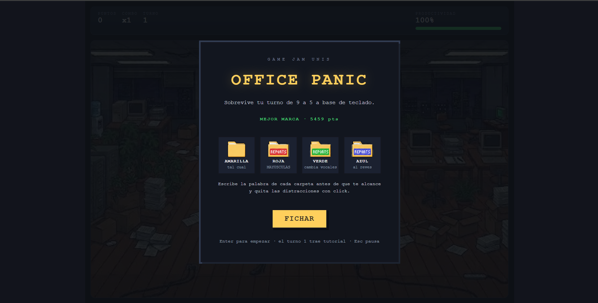
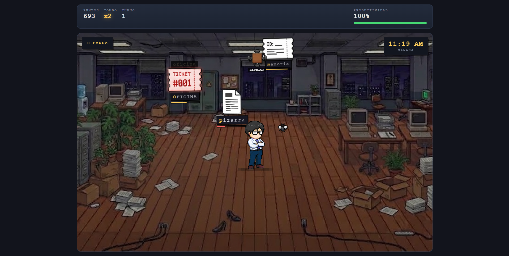
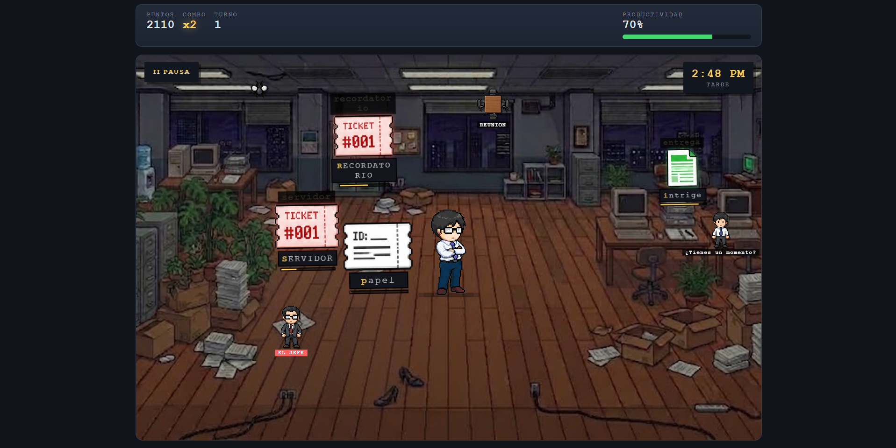
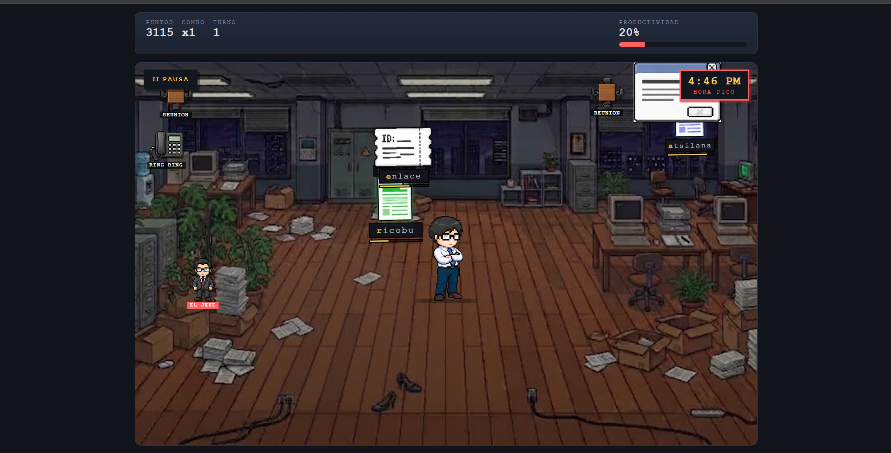

# Office Panic


Juego de mecanografía arcade ambientado en una oficina. Escribe palabras para repeler carpetas que convergen hacia tu personaje mientras esquivas distracciones y mantienes tu productividad por encima de cero.

Juégalo aqui --> [itch.io/Office Panic](https://cruzafk18.itch.io/office-panic)



---

## Contexto

Este proyecto fue desarrollado para la **segunda jornada de la Game Jam UNIS**, un evento donde equipos de 3 personas tenían 5 horas para crear un videojuego completo desde cero.

El equipo estuvo conformado por:

| Nombre | Rol |
|---|---|
| **Juan Pablo Torres** | Diseño, idea general y assets visuales |
| **Diego Cruz** | Desarrollo, lógica y pruebas |
| **Kenneth Bernales** | Diseño de audio, música y efectos de sonido |

La inspiración surgió de juegos como **Fruit Ninja**, **ZType** y el **Doodle de Google para Halloween 2016**. De estas referencias se extrajo la mecánica de mecanografía en tiempo real (ZType/Doodle) aplicada a un entorno de oficina, con elementos visuales que convergen hacia el jugador.

---

## Mecánica del juego

Sobrevive tu turno de oficina de **9:00 AM a 5:00 PM**. Desde los bordes de la pantalla llegan carpetas con palabras que debes escribir con el teclado antes de que alcancen a tu personaje en el centro.

### Modificadores de carpeta

| Color | Modificador | Ejemplo |
|---|---|---|
| Amarilla | Normal | `correo` |
| Roja | Mayúsculas | `CORREO` |
| Verde | Vocales desplazadas (a→e, e→i, i→o, o→u, u→a) | `cerriu` |
| Azul | Al revés | `oerroc` |

### Distracciones

Aparecen elementos que recorren la oficina y al tocar al personaje causan efectos de pantalla (desenfoque o oscurecimiento). Se eliminan haciendo click sobre ellas.

- Mosca, compañero, jefe, teléfono, café, notificación, reunión, popup

### Sistema de puntuación

- Completar una palabra otorga puntos base más bonificación por velocidad.
- Encadenar aciertos sin errores sube el **combo** (x2, x3, x4).
- Equivocarse o dejar que una carpeta llegue reduce la **productividad** y reinicia el combo.
- Productividad en 0 = despedido (game over).

### Turnos

La dificultad escala por turnos. Cada turno acelera el ritmo de aparición, reduce el tiempo por palabra y añade nuevos modificadores. A partir de la tarde se desbloquean las carpetas verdes y en la hora pico (3:00-5:00 PM) las azules.

---

## Capturas de pantalla

### Menú de inicio


### Turno de la mañana



### Turno de la tarde



### Hora pico



---

## Video

Puedes ver una demo de la partida en YouTube:

[](https://youtu.be/3IMBrLQVgmg)

---

## Controles

| Acción | Tecla |
|---|---|
| Escribir palabra | Teclado |
| Eliminar distracción | Click |
| Empezar / Siguiente turno / Reintentar | Enter |
| Pausa | Escape |

---

## Tecnologías

### Frontend

- HTML5
- CSS3 (estética pixel art, animaciones CSS, sin Canvas)
- JavaScript (ES Modules, sin frameworks)

### Herramientas

- Vite 6.4 (bundler y servidor de desarrollo)
- Web Audio API (efectos de sonido con AudioContext)
- localStorage (mejor puntuación y configuración de volumen)

### Assets

- Sprites del personaje, enemigos y elementos generados con **ChatGPT**
- Fondo de oficina generado con **Gemini**
- Música y efectos de sonido generados con **ElevenLabs**

---

## Estructura del proyecto

```text
.
├── assets/
│   ├── images/
│   │   ├── office-bg.jpg
│   │   ├── character/
│   │   ├── documento/
│   │   ├── reporte/
│   │   ├── reunion/
│   │   ├── ticket/
│   │   └── distracciones/
│   ├── music/
│   │   ├── menu.mp3
│   │   ├── gameplay.mp3
│   │   ├── rush.mp3
│   │   └── gameover.mp3
│   └── sounds/
│       ├── boss/
│       ├── coffee/
│       ├── combo/
│       ├── correct/
│       ├── coworker/
│       ├── distraction-clear/
│       ├── error/
│       ├── expired/
│       ├── fireball/
│       ├── fly/
│       ├── gameover/
│       ├── keypress/
│       ├── meeting/
│       ├── notification/
│       ├── phone/
│       └── popup/
├── src/
│   ├── main.js
│   ├── style.css
│   ├── config.js
│   ├── audio/
│   │   └── AudioManager.js
│   ├── data/
│   │   ├── words.js
│   │   ├── modifiers.js
│   │   └── distractions.js
│   ├── game/
│   │   ├── Game.js
│   │   ├── ReportManager.js
│   │   ├── DistractionManager.js
│   │   ├── DifficultySystem.js
│   │   ├── ModifierSystem.js
│   │   ├── Schedule.js
│   │   └── spawn.js
│   └── ui/
│       ├── GameUI.js
│       └── Effects.js
├── index.html
├── vite.config.js
├── package.json
└── package-lock.json
```

---

## Instalación

### Opción A — Desde el código fuente

1. Clonar el repositorio.

```bash
git clone https://github.com/jptorresg/Game-Jam-UNIS.git
```

2. Ingresar al directorio del proyecto.

```bash
cd Game-Jam-UNIS
```

3. Instalar las dependencias.

```bash
npm install
```

4. Iniciar el servidor de desarrollo.

```bash
npm run dev
```

5. Acceder al juego desde:

```
http://localhost:5173
```

### Opción B — Versión compilada

1. Generar la versión de producción.

```bash
npm run build
```

2. Servir la carpeta `dist` con cualquier servidor estático.

```bash
npx serve dist
```

3. Acceder al juego desde:

```
http://localhost:3000
```

---

## Requisitos

- Navegador moderno de escritorio (Chrome, Edge o Firefox actualizados).
- Teclado y ratón.
- El audio se activa con el primer click o tecla dentro de la página (política de autoplay del navegador).
- Mantener la pestaña en primer plano para que el juego y el audio funcionen correctamente.
- Funciona completamente offline: no requiere conexión a internet.

---

## Créditos

### Game Jam UNIS

- Repositorio: <https://github.com/jptorresg/Game-Jam-UNIS>

### Equipo

- **Juan Pablo Torres** — Diseño, idea general y assets visuales
  - GitHub: <https://github.com/jptorresg>
  - LinkedIn: <https://www.linkedin.com/in/juan-pablo-torres-g>
- **Diego Cruz** — Desarrollo, lógica y pruebas
  - GitHub: <https://github.com/DiegoCrUz-afk>
  - Linkedin: <https://www.linkedin.com/in/diego-cruz-ab9a05358/>
- **Kenneth Bernales** — Música y efectos de sonido
  - GitHub: <https://github.com/Kennethber>
  - Linkedin: <https://www.linkedin.com/in/kenneth-ra%C3%BAl-bernales-yee-258a00358/>
